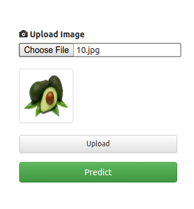
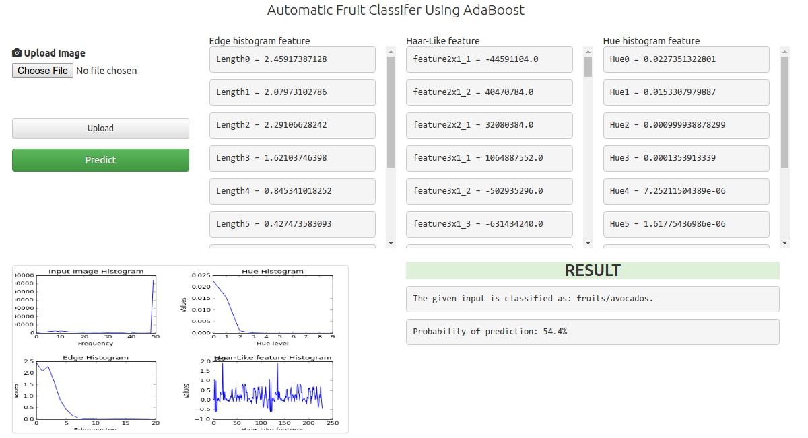

# About FYPFruitClassifier
This was the Final Year Project called (Automatic Fruit Classifier using AdaBoost Algorithm) done in 4th year.
Read the full documentation here: [https://git.io/vyxGD](https://git.io/vyxGD)

# Summary
Firstly, we pre-process the training sample of fruits’ images. Preprocessing includes separating foreground and background, scaling and cropping the image to reduce the dimension so that the processing is fast. Then, we extract features from the fruit’s image, which includes color, texture and shape of the fruit image. Extracted features are then fitted into the AdaBoost classifier machine learning algorithm. Finally, the results obtained from the machine learning network are cross validated with the test sample. The output obtained will give us the prediction accuracy and class of the fruit that it has acknowledged. Experimental results have been collected using a fruit image database consisting of 5 different classes of fruits and 120 fruits images overall. Therefore, average prediction accuracy of more than 55% is obtained with a learning rate of 0.7.

# Tools and Technologies used
* Scikit learn to implement machine learning algorithm.
* Flask web microframework for web interface
* Matplotlib for graphs generation
* SimpleCV for image processing

# Recommendations
Extracting multiple features from the image has massive impact in the prediction and cross validation score in addition with choosing of different powerful machine learning algorithm might increase the prediction accuracy. However, implementation of neural network or deep learning can produce more better and accurate results and will be faster as well.

# User Interface

# Data source
M. Škrjanec. “Automatic fruit recognition using computer vision”, Bsc Thesis, (Mentor: Matej Kristan), Fakulteta za računalništvo in informatiko, Univerzav Ljubljani, 2013.
